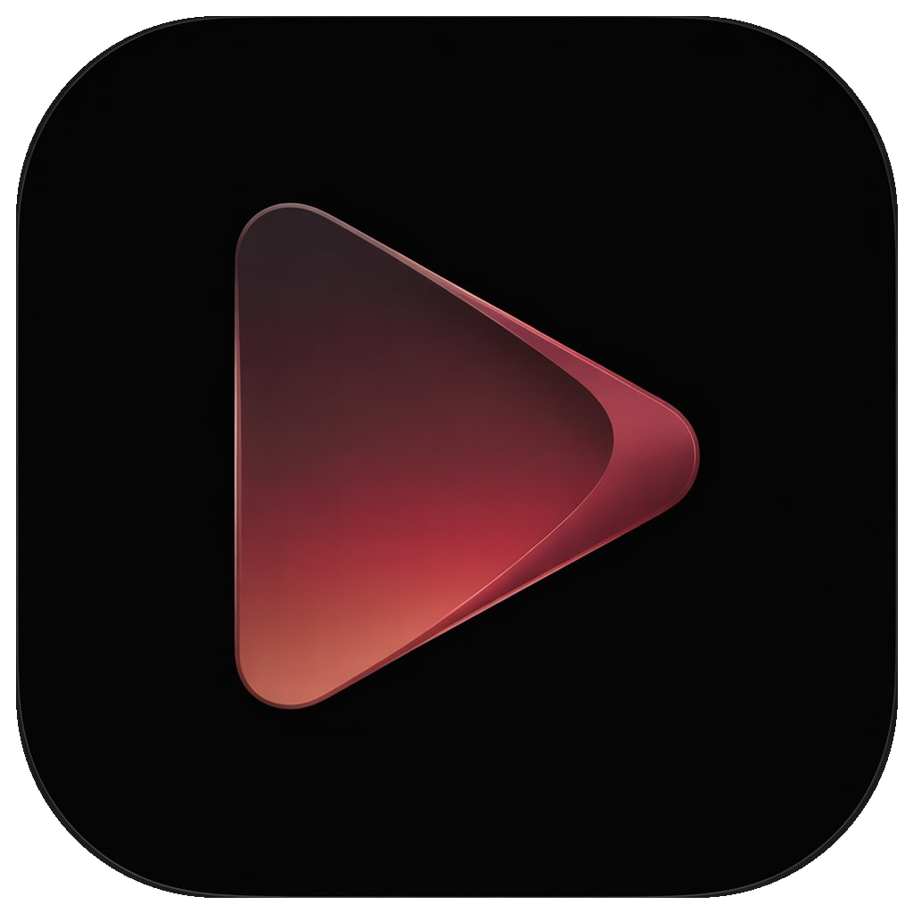

<p align="center">
  
</p>

<h1 align="center">JellyGo</h1>

<p align="center">
  
  
  
  
</p>

**JellyGo** is a fast, modern, and fully native iOS client for [Jellyfin](https://jellyfin.org/) media servers. Built from the ground up with SwiftUI, it provides a seamless way to browse and play your self-hosted media library on the go.

## ✨ Features

- **Hero Browse:** Full-screen hero banner with featured content, Continue Watching, Next Up, Latest Movies & Shows sections on the home screen.
- **Detail Pages:** Backdrop with parallax, logo, metadata chips, genres, ratings (TMDb & critic), cast & crew, season/episode browser with resume highlighting.
- **Custom Player:** VLC-powered player with pinch-to-zoom, brightness/volume swipe gestures with glass indicator, subtitle/audio track picker, transcode audio switching, and aspect-fill by default.
- **Resume Playback:** Picks up exactly where you left off — both on the detail page and inside the player.
- **Playback Reporting:** Reports start, progress (every 10 s), and stop events to the Jellyfin server.
- **Search:** Full-text search across your entire library.
- **Library Browser:** Browse all Jellyfin libraries with grid layout; Favorites card at top with a random cover from your favorite items.
- **Favorites & Watched:** Toggle favorite and watched state directly from the detail page.
- **Person Detail:** Tap any cast or crew member to see their filmography.
- **Apple Liquid Glass UI:** Action buttons and player indicators use iOS 26 native `glassEffect`.
- **Secure Auth:** Token-based login with Keychain storage; session restores automatically on launch.
- **Multi-Account & Quick Switch:** Seamlessly switch between multiple Jellyfin servers and accounts without re-authenticating. Tokens are shared across URL variants of the same server (e.g. local IP vs domain), so you never get logged out when your network changes.
- **Localization:** 18 languages — English, Turkish, Arabic, Azerbaijani, Danish, German, Spanish, Persian, French, Italian, Japanese, Korean, Dutch, Portuguese, Russian, Swedish, Ukrainian, Chinese.

### Offline & Downloads

- **Offline Mode:** Dedicated offline view with hero banner, continue watching, next up, and dynamic content sections — all from local cache.
- **Background Downloads:** Download movies and episodes for offline viewing via URLSession background sessions.
- **Quality Selection:** Choose Direct (original file) or transcoded quality (1080p / 720p / 480p / 360p) per download.
- **Audio Language Selection:** When downloading with transcode, choose which audio language to include.
- **Subtitle Downloads:** Text-based subtitle tracks (SRT) are automatically downloaded alongside the video. Auto-repair downloads missing subtitles when viewing online.
- **Stable Queue:** Active, paused, and queued downloads maintain stable ordering in the Downloads tab.
- **Pause & Resume:** Downloads can be paused mid-way and resumed from the exact byte offset.
- **Kill Recovery:** Downloads in progress when the app is killed are automatically recovered on next launch.
- **In-App Banner:** A banner notification appears when a download starts; tap it to open the item's detail page directly.
- **Progress Popover:** Tap the download button on an actively downloading item to see a live progress popover with pause and cancel controls.

## 📱 Screenshots

| Home | Media Details | Player |
| :---: | :---: | :---: |
|  |  |  |

## 🛠️ Tech Stack

| Layer | Technology |
|---|---|
| Language | Swift 6 |
| UI Framework | SwiftUI |
| Player Engine | MobileVLCKit 3.7.3 (XCFramework) |
| Networking | URLSession + async/await |
| Background Downloads | URLSession background session + URLSessionDownloadDelegate |
| Auth Storage | Keychain |
| State Management | ObservableObject / @EnvironmentObject |

## 🚀 Getting Started

### Prerequisites

- **macOS** with Xcode 16 or later
- **iOS Device or Simulator** running iOS 26.0+
- A running **Jellyfin Server** (v10.8.0 or newer)

### Installation

1. Clone the repository:
   ```bash
   git clone https://github.com/baykatre/jellygo.git
   cd jellygo/JellyGo
   ```

2. Open `JellyGo.xcodeproj` in Xcode.

3. The MobileVLCKit XCFramework is included locally under `MobileVLCKit-binary/` (not tracked in git due to size). Download it from the [MobileVLCKit releases](https://code.videolan.org/videolan/VLCKit/-/releases) and place it there.

4. Select your target device/simulator and hit **Run**.

### Quick Switch Setup

If you access your Jellyfin server from different URLs (e.g. `192.168.1.100:8096` at home and `jellyfin.example.com` outside), add both URLs to the same account:

1. Go to **Settings → Accounts**.
2. Log in with your first server URL.
3. Tap **Add Server** and log in with the second URL using the same credentials.
4. JellyGo automatically shares your session token across both URLs, so switching networks never logs you out.

## 📄 License

This project is licensed under the MIT License — see the [LICENSE](LICENSE) file for details.
