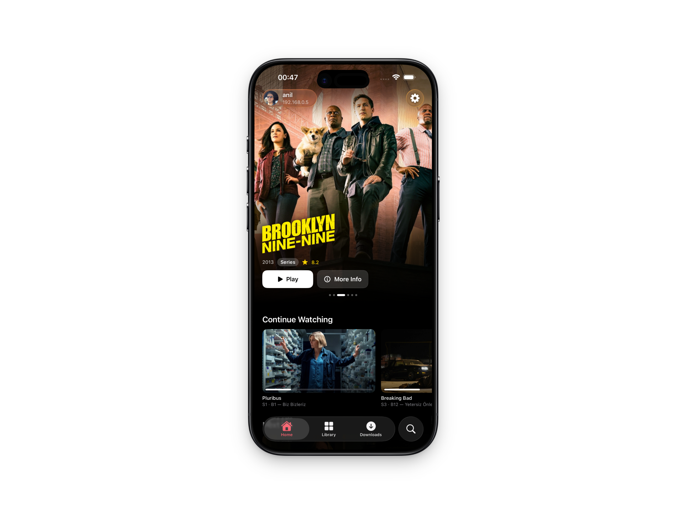
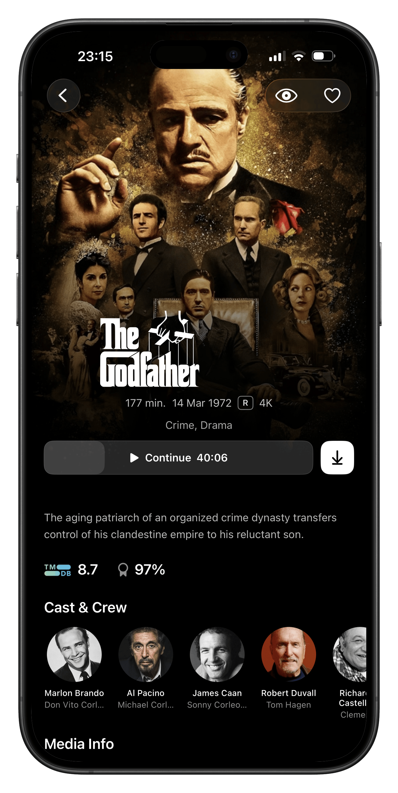
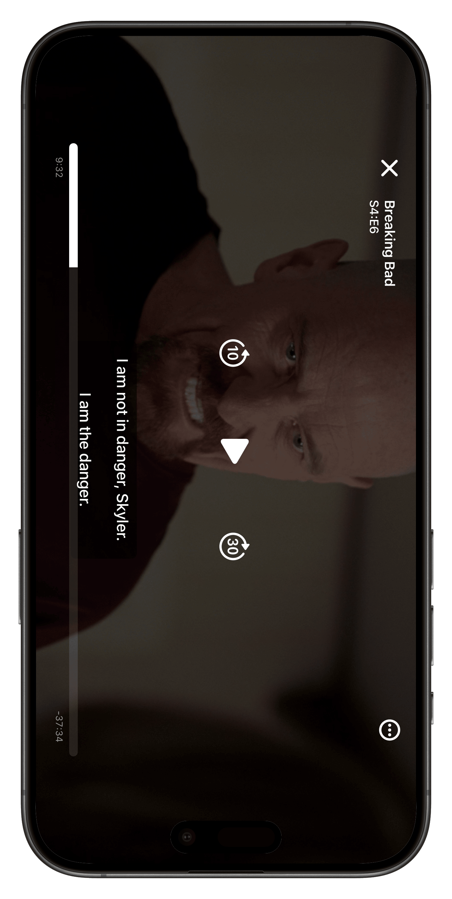

# JellyGo 🎬


**JellyGo** is a fast, modern, and fully native iOS client for [Jellyfin](https://jellyfin.org/) media servers. Built from the ground up with Swift, it leverages hardware acceleration for buttery-smooth playback and provides a seamless, secure way to access your self-hosted media library on the go.

## ✨ Features

* **Native Performance:** Fully native UI built with UIKit, ensuring responsive navigation and low memory footprint.
* **Direct Play & Direct Stream:** Prioritizes native playback to minimize server-side transcoding overhead.
* **Advanced Networking:** Full support for local connections, reverse proxies, and VPN/mesh networks (e.g., Tailscale, WireGuard).
* **Robust Media Player:** Hardware-accelerated decoding using `AVFoundation`
* **Offline Mode (WIP):** Download media directly to your device for offline viewing.
* **Modern Authentication:** Secure login supporting Jellyfin's Quick Connect and token-based auth.

## 📱 Screenshots

| Home | Media Details | Player |
| :---: | :---: | :---: |
|  |  |  |

## 🛠️ Tech Stack & Architecture

JellyGo is designed with scalability and maintainability in mind:
* **Language:** Swift 5.x
* **Framework:** SwiftUI
* **Media Parsing:** Native `Codable` implementations tailored for the Jellyfin REST API.
* **Dependency Management:** Swift Package Manager (SPM)

## 🚀 Getting Started

Follow these instructions to get a copy of the project up and running on your local machine for development and testing purposes.

### Prerequisites
* **macOS** with Xcode 15.0 or later.
* **iOS Device or Simulator** running iOS 17.0+.
* A running **Jellyfin Server** (v10.8.0 or newer) reachable from your network.

### Installation

1. Clone the repository:
   ```bash
   git clone [https://github.com/](https://github.com/)[YOUR_USERNAME]/JellyGo.git
   cd JellyGo
